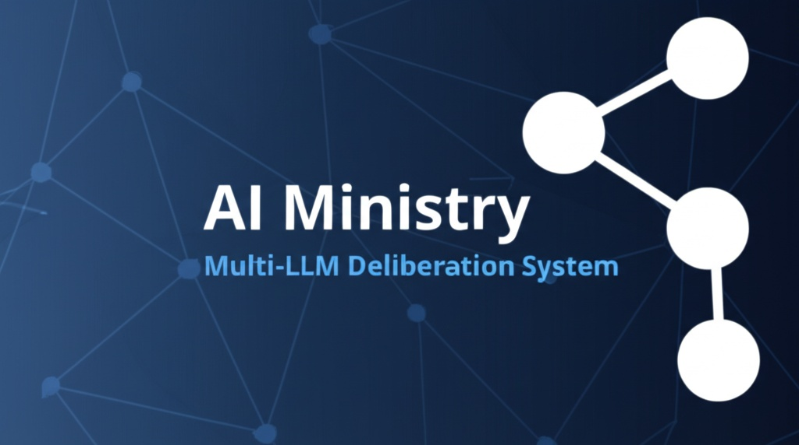

# AI MINISTRY




Thanks to https://github.com/karpathy/llm-council for the inspiration and initial code base.

The idea of this repo is that instead of asking a question to your favorite LLM provider (e.g. OpenAI GPT 5.1, Google Gemini 3.0 Pro, Anthropic Claude Sonnet 4.5, xAI Grok 4, eg.c), you can group them into your "AI Ministry". This repo is a simple, local web app that essentially looks like ChatGPT except it uses OpenRouter to send your query to multiple LLMs, it then asks them to review and rank each other's work, and finally a Chairman LLM produces the final response.

In a bit more detail, here is what happens when you submit a query:

0. **Stage 0: Research (conditional)**. A fast intent classifier first decides whether the query actually needs current web facts (current events, prices, recent releases, etc.). If yes, the researcher runs **xAI's Grok with the `web_search` tool** to produce a structured briefing (Key Facts + Summary + citations). If xAI is unavailable or its key is missing, the researcher transparently falls back to **DuckDuckGo + an LLM synthesizer** — no extra API key required. The briefing is injected as context into every subsequent stage so the council reasons from grounded facts. Council models do **not** search independently.
1. **Stage 1: First opinions**. The user query is given to all LLMs individually, and the responses are collected. The individual responses are shown in a "tab view", so that the user can inspect them all one by one.
2. **Stage 2: Review**. Each individual LLM is given the responses of the other LLMs. Under the hood, the LLM identities are anonymized so that the LLM can't play favorites when judging their outputs. The LLM is asked to rank them in accuracy and insight.
3. **Stage 3: Final response**. The designated Chairman of the LLM Council takes all of the model's responses and compiles them into a single final answer that is presented to the user.

## Vibe Code Alert

This project was based on Karpathy's 99% vibe coded Saturday hack because I wanted to extend the number of LLMs side by side. It's nice and useful to see multiple responses side by side, and also the cross-opinions of all LLMs on each other's outputs. 

## Setup

### 1. Install Dependencies

The project uses [uv](https://docs.astral.sh/uv/) for project management.

**Backend:**
```bash
uv sync
```

**Frontend:**
```bash
cd frontend
npm install
cd ..
```

### 2. Configure Environment

Copy the example environment file and customize it:

```bash
cp .env.example .env
```

**Required settings:**

```bash
# LLM API Configuration (choose one)
# Option A: LiteLLM local proxy (default)
LLM_API_URL=http://localhost:4000/chat/completions
LLM_API_KEY=sk-litellm-master-key

# Option B: OpenRouter
# LLM_API_URL=https://openrouter.ai/api/v1/chat/completions
# OPENROUTER_API_KEY=sk-or-v1-...
```

Get your OpenRouter API key at [openrouter.ai](https://openrouter.ai/).

### 3. Configure Authentication

The application requires user authentication to protect your LLM API credits and conversation data.

**Required for production:**

```bash
# Generate a secure secret key
python -c "import secrets; print(secrets.token_urlsafe(32))"

# Add to your .env file
AUTH_SECRET_KEY=your-generated-secret-key-here
```

**Optional settings:**

```bash
# Token expiration time in minutes (default: 60)
ACCESS_TOKEN_EXPIRE_MINUTES=60
```

> ⚠️ **Security Warning:** If `AUTH_SECRET_KEY` is not set, the application will auto-generate a random key on startup. This is **insecure for production** because:
> - Tokens will be invalidated on every server restart
> - Users will need to log in again after each restart
> - The key may not be cryptographically strong enough

**Authentication features:**
- User registration and login with email/password
- JWT token-based authentication
- All conversation endpoints are protected
- Users can only access their own conversations (IDOR protection)
- API credit-consuming endpoints require authentication

### 4. Configure Research / Stage 0 (Optional)

Stage 0 grounds the council in current web facts before deliberation. It's **enabled by default** with sane defaults — nothing extra is required, but you'll get higher-quality briefings if you add an xAI key.

```bash
# Optional — primary research path (Grok web_search). Without this key,
# the researcher silently falls back to DuckDuckGo + LLM synthesis.
XAI_API_KEY=xai-...
```

Get an xAI key at [console.x.ai](https://console.x.ai/).

Tune behavior in `ministry_config.yaml` under `researcher:`:

```yaml
researcher:
  enabled: true                          # set false to disable Stage 0 entirely
  model: grok-4-1-fast                   # xAI model for primary research path
  timeout: 120

  fallback:                              # used when xAI fails or no key is set
    enabled: true
    synthesis_model: google/gemini-2.5-flash

  intent_classifier:                     # gates Stage 0 — skips it for math,
    enabled: true                        # reasoning, coding, opinion queries
    model: google/gemini-2.5-flash       # so you don't pay latency when stale
                                         # knowledge isn't a risk
```

The classifier defaults to "do research" on any failure (network blip, malformed response) — stale info is worse than a few extra seconds of latency.

### 5. Configure Models (Optional)

Edit `backend/config.py` to customize the ministry:

```python
COUNCIL_MODELS = [
    "openai/gpt-5.1",
    "google/gemini-3-pro-preview",
    "anthropic/claude-sonnet-4.5",
    "x-ai/grok-4",
]

CHAIRMAN_MODEL = "google/gemini-3-pro-preview"
```

## Running the Application

**Option 1: Use the start script**
```bash
./start.sh
```

**Option 2: Run manually**

Terminal 1 (Backend):
```bash
uv run python -m backend.main
```

Terminal 2 (Frontend):
```bash
cd frontend
npm run dev
```

Then open http://localhost:5173 in your browser.

## Tech Stack

- **Backend:** FastAPI (Python 3.10+), async httpx, OpenRouter / LiteLLM / direct provider routing
- **Frontend:** React + Vite, react-markdown for rendering
- **Research (Stage 0):** xAI Grok `web_search` (primary) + DuckDuckGo via `ddgs` (zero-key fallback) + fast-LLM intent classifier
- **Storage:** SQLite (`data/conversations/ministry.db`)
- **Package Management:** uv for Python, npm for JavaScript
